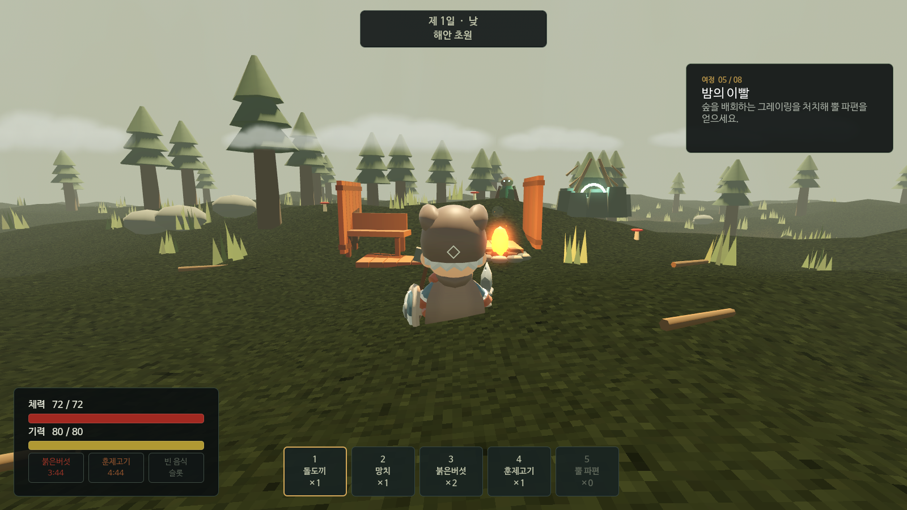

# 북해의 잿불



Godot 4.4.1로 만든 발헤임풍 3인칭 3D 생존 게임 수직 슬라이스입니다. 안개 낀 해안 초원에서 채집을 시작해 돌도끼와 망치를 만들고, 야영지를 세우고, 그레이링과 밤 습격을 버틴 뒤 제단에서 뿔 달린 숲 수호자 **에이크비드**를 소환해 쓰러뜨리는 하나의 플레이 루프를 제공합니다.

이 프로젝트는 Iron Gate AB 및 Valheim과 무관한 비공식 팬 오마주입니다. 원작의 코드·데이터·에셋은 사용하지 않습니다.

## 실제 구현 범위

- **탐색과 생존:** 3인칭 카메라, WASD 이동, 질주, 점프, 기력 기반 회피·방어. 시간에 따라 줄어드는 굶주림 게이지 대신 음식 3슬롯이 지속시간 동안 최대 체력·기력을 높입니다.
- **해안 세계:** 시드가 고정된 절차 높이 함수로 생성되는 초원/침엽수 숲/모래 해안, 충돌 지형, 파도 수면, 절차 구름 하늘, 높이 안개, 낮·밤, 방향광 그림자, 바람에 흔들리는 삼각 풀 실루엣과 나무를 포함합니다.
- **채집:** 가지·돌·버섯은 `E`로 줍습니다. 나무와 바위는 돌도끼로 공격해야 하며, 파괴 후 실제 줍기 아이템을 떨어뜨립니다.
- **타격감:** 히트 펄스, 파편, 부유 피해 숫자, 범위 예고 링, 카메라 흔들림, 피격 화면 플래시와 외부 음원 없이 생성되는 채집·타격·피격·제작·건축·경고 효과음이 적용됩니다.
- **제작:** 손 제작 패널에서 돌도끼와 망치를 만듭니다. 성공 및 부족 재료를 한국어 UI로 표시합니다.
- **건축:** 망치를 선택하면 모닥불·작업대·나무 바닥·나무 벽을 순환 선택할 수 있습니다. 고스트의 유효/무효 색, 거리·수면·경사·겹침·재료 검증, 45도 회전을 지원하며 모닥불에는 불빛 흔들림과 가벼운 연기·불티가 적용됩니다.
- **전투와 습격:** 그레이링은 배회→추격→공격→피격→사망 상태로 행동하고 뿔 파편과 음식을 떨어뜨립니다. 첫 밤부터 3마리 습격이 발생합니다.
- **보스:** 그레이링의 뿔 파편을 해안 제단에 바치면 에이크비드가 소환됩니다. 근접 공격 외에 예고 후 돌진과 위치가 고정되는 뿌리 강타를 사용하며 전용 HP 바와 승리 화면이 있습니다.
- **여정 목표:** 채집→돌도끼 제작→벌목→모닥불/작업대→적 처치→제단 공물→보스 처치 순서가 실제 인벤토리·설치·전투 상태와 연결됩니다.
- **저장:** `user://coastal_survival_v2.json`에 플레이어 위치, 인벤토리, 음식, 목표, 월드 시간, 습격 여부, 설치 건축물을 JSON으로 저장합니다. 현재 저장 버전은 `2`입니다.
- **UI:** 1600×900 기준이며 리사이즈에 대응합니다. 좌측 생존 상태, 상단 시간/바이옴, 우측 목표, 중앙 조준점/상호작용, 하단 1~5 퀵슬롯, 알림, 건축 안내, 보스 바를 제공합니다. 모든 핵심 UI는 포함된 NanumBarunGothic 폰트를 사용합니다.

## 조작

| 입력 | 동작 |
|---|---|
| `WASD` | 이동 |
| 마우스 | 카메라 회전 |
| `Shift` | 질주 |
| `Space` | 점프 |
| `Ctrl` 또는 `Alt` | 회피 |
| `E` | 줍기 / 제단 상호작용 |
| 좌클릭 | 공격 / 건축물 설치 |
| 우클릭 | 방어 / 건축 모드 종료 |
| `Tab` 또는 `C` | 제작 패널 열기·닫기 |
| `1`~`5` | 돌도끼 / 망치 / 버섯 / 고기 / 뿔 파편 퀵슬롯 |
| `Q` | 건축 부품 변경 |
| `R` | 건축물 45도 회전 |
| 마우스 휠 | 카메라 거리 |
| `F5` / `F9` | 저장 / 불러오기 |
| `Esc` | 패널 닫기 / 마우스 해제 |

망치는 제작 직후 건축 모드로 들어갑니다. 이후 `2`를 눌러 다시 진입할 수 있습니다. 음식 퀵슬롯 `3`과 `4`는 누르면 즉시 섭취하며, 같은 음식은 효과가 끝나기 전 중복 섭취할 수 없습니다.

## 실행과 CLI

저장소에 포함된 Linux용 Godot 4.4.1 실행 파일을 사용할 수 있습니다.

```bash
cd /home/main/z-project/valheim
.tools/Godot_v4.4.1-stable_linux.x86_64 --path .
```

개발/자동화 인수는 Godot 인수 구분자 `--` 뒤에 전달합니다.

```bash
# 타이틀을 건너뛰고 실제 게임 시작
.tools/Godot_v4.4.1-stable_linux.x86_64 --path . -- --auto

# 핵심 씬, 지형, 플레이어 데이터, 제작/건축/목표/저장 계약 검사 후 종료
.tools/Godot_v4.4.1-stable_linux.x86_64 --headless --path . -- --smoke

# 충분한 프레임을 렌더한 실제 게임 화면을 저장 후 종료
.tools/Godot_v4.4.1-stable_linux.x86_64 --path . -- --capture=/tmp/north-sea-camp.png
```

`--capture`는 **쓰기 가능한 절대 PNG 경로**만 받습니다. 캡처 모드는 플레이어 앞에 실제 건축 시스템으로 만든 작은 야영지, 실제 적 인스턴스, 실제 제단을 배치하고 120프레임 뒤 현재 뷰포트를 저장합니다. 별도 이미지 합성이나 UI 목업을 사용하지 않습니다. 그래픽 디스플레이와 OpenGL 3.3 호환 드라이버가 필요하며, 헤드리스 환경에서는 정상 렌더 결과를 보장하지 않습니다.

## 프로젝트 구조

```text
scenes/
├── game.tscn
├── player/player.tscn
└── entities/{enemy,resource_node,altar}.tscn
scripts/
├── game/game.gd                 # 목표, 낮/밤, 습격, CLI, 전체 오케스트레이션
├── world/world.gd               # 지형, 해안, 물, 환경, 식생, 월드 배치
├── player/player.gd             # 이동, 카메라, 전투, 인벤토리, 음식
├── entities/{enemy,resource_node,altar}.gd
├── systems/{building_system,save_system}.gd
├── ui/hud.gd
└── vfx/feedback.gd
```

전역 autoload는 사용하지 않습니다. `game.tscn`이 명시적으로 시스템을 조립하며, InputMap은 `project.godot`에 정의되어 있습니다.

## 알려진 제한

- 수직 슬라이스 범위는 해안 초원/숲 한 지역, 일반 적 한 종류, 보스 한 종류입니다. 월드 스트리밍, 항해, 던전, 장비 내구도, 멀티플레이는 구현하지 않았습니다.
- 적은 NavMesh 대신 작은 단일 지형에서 직접 추격합니다. 복잡한 건축물로 완전히 둘러싸면 경로를 찾지 못할 수 있습니다.
- 건축은 배치 검증과 저장을 제공하지만 구조 안정성, 스냅 포인트, 철거는 포함하지 않습니다.
- 음악은 포함하지 않으며, 효과음은 런타임에 생성하는 짧은 모노 WAV로만 구성됩니다.
- `assets/models/Knight.glb`는 보존되어 있으나 라이선스가 명확하지 않아 런타임에서 사용하지 않습니다.

## 라이선스와 에셋

- 코드: [MIT](LICENSE)
- 주인공 모델: [KayKit Adventurers — Barbarian](https://github.com/KayKit-Game-Assets/KayKit-Character-Pack-Adventures-1.0) (Kay Lousberg) — CC0. `assets/models/Barbarian.glb`를 런타임에 검사해 MeshInstance3D가 있을 때만 사용하며, 로드할 수 없으면 절차적 바이킹 실루엣으로 대체합니다.
- 텍스처: [ambientCG](https://ambientcg.com/) — CC0 (Grass001, Ground103, Rock058, Snow010A, Ground093C, Bark012, Planks030A, Bricks097, Fabric061, Metal055A, Gravel024)
- 폰트: 나눔글꼴 — SIL Open Font License 1.1, `assets/fonts/`
- Valheim은 Iron Gate AB의 상표입니다. 이 프로젝트는 비공식 팬 오마주이며 어떠한 제휴 관계도 없습니다.
